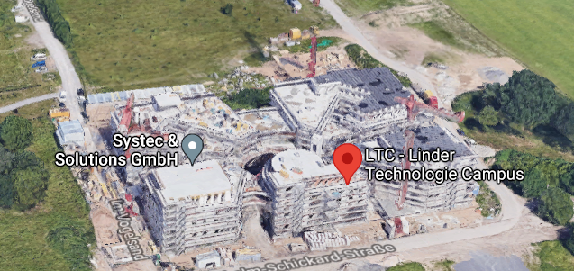

# Robotics and Automation Lab – Virtual Tour

## 📖 Projektbeschreibung
Dieses Projekt wurde im Rahmen des Moduls **Projektmanagement** unter der Betreuung von  
**Prof. Dr.-Ing. habil. Hein** und **Prof. Wurll** entwickelt. Beide leiten gemeinsam das **Labor für Robotik und Automatisierung**.  

Das Labor befand sich ursprünglich im **K-Gebäude der Hochschule** und zieht seit dem Sommersemester 2021 auf den neuen Campus (**HKA 2030+ / TP**) um.  
Der neue Campus beherbergt den Masterstudiengang **"Robotics and Artificial Intelligence in Production"** sowie das Labor für Robotik und Automatisierung, das Studierenden praxisnahe Lehre und Forschung ermöglicht.  

Wir sind ein Team aus vier Studierenden. Unsere Idee – gemeinsam mit unseren Professoren – war es, die neuen Räumlichkeiten des Labors mithilfe eines **3D-Scanners** zu erfassen.  
Unser Beitrag soll eine **Basis für zukünftige Teams** darstellen, die darauf aufbauen können.

---

## 🛠️ Verwendete Technik
Für die 3D-Erfassung nutzten wir einen speziellen Scanner.  
Damit konnten wir ein Modell der Räumlichkeiten erstellen, das als Grundlage für die **virtuelle Tour** dient.

---

## 🌐 Virtuelle Tour
👉 Eine **Demo** findest du hier:  
[**Zur virtuellen Tour**](https://allienceproject.github.io)

---

## 🎮 Steuerung
Wir haben zwei Steuerungsmodi implementiert, die du ausprobieren kannst:

### 1. First Person Control
Navigation wie in einem 3D-Spiel:
- **Maus bewegen** → Blickrichtung ändern  
- **Linke Maustaste** → Vorwärts bewegen  
- **Rechte Maustaste** → Rückwärts bewegen  

### 2. Orbit Control
Objekt-orientierte Kamerasteuerung:
- **Linke Maustaste** → Objekt rotieren  
- **Rechte Maustaste** → Kamera um die Szene bewegen  
- **Mausrad** → Rein- und Rauszoomen  

---

## 📂 Ressourcen
- Original-Repository: [AllienceProject/AllienceProject.github.io](https://github.com/AllienceProject/AllienceProject.github.io)  
- Demo-Seite: [allienceproject.github.io](https://allienceproject.github.io)  
